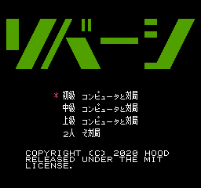

# リバーシ

<p>
  <a href="https://github.com/blue-hood/reversi/releases" target="_blank">
    
  </a>
  <a href="#" target="_blank">
    
  </a>
  <a href="https://github.com/blue-hood/reversi/blob/master/LICENSE" target="_blank">
    
  </a>
</p>

> FC 互換機専用ソフト「リバーシ」。<br />
> 石を置いて敵をはさみ込み、自陣を広げていきます。<br />
> 角をおさえるのが攻略のポイントです。

## 対局の種類



- コンピュータと対局<br />
初級、中級、上級の強さでコンピュータと対局します。<br />
コンピュータに勝つと、続けて次の対局に進めます。<br />
引き分けの場合は再対局となります。

- 2 人で対局<br />
Ⅰ・Ⅱコントローラを使用して 2 人で対局します。<br />
対局が終わるごとにゲーム終了となります。

※黒番と白番は、対局開始のときにランダムで決まります。

## コントローラの操作の説明

- 十字ボタン<br />
カーソルを 4 方向に動かし、石の打つ位置を決めます。

- A ボタン<br />
カーソルの位置に石を打ちます。

- SELECT ボタン<br />
＊印を動かし、対局の種類を選びます。

- START ボタン<br />
選んだ種類の対局を開始します。<br />
対局が終了したときに押すと、勝ち抜きで次の対局を開始します。

※コンピュータと対局する場合は、Ⅰコントローラを使用してください。<br />
※対局中にリセットスイッチを押すと、それまで記憶されていた局面が消去されます。

## Build

```sh
nesasm reversi.asm
```

## Author

 **Hood <hato6502@gmail.com> (https://github.com/blue-hood)**

## 🤝 Contributing

Contributions, issues and feature requests are welcome!<br />Feel free to check [issues page](https://github.com/blue-hood/reversi/issues).

## Show your support

Give a ⭐️ if this project helped you!
